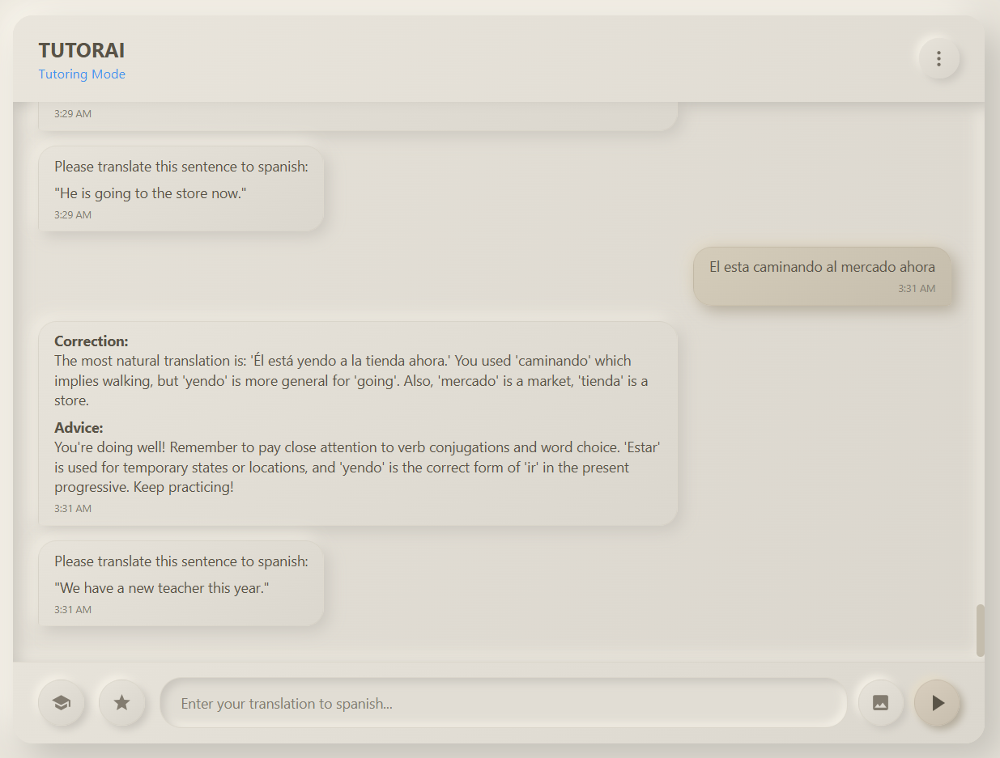
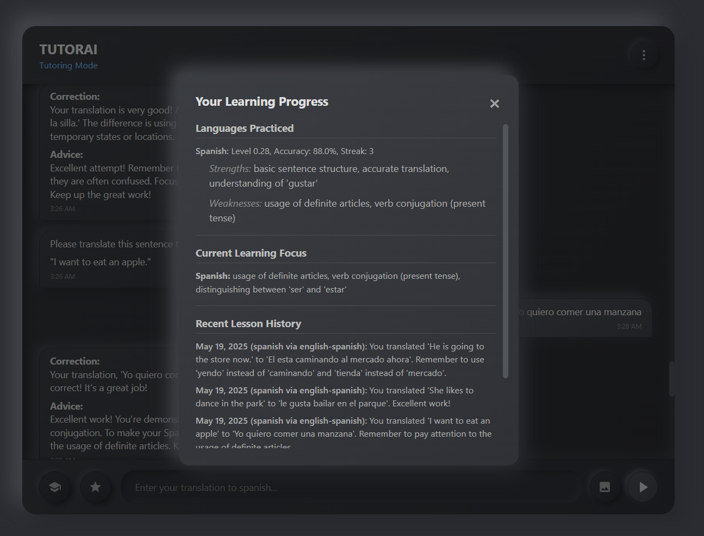

# TUTORAI Chat (Minitutor/Минирепетитор)

EN: A lightweight, privacy-focused, single-file HTML chat application designed for interacting with local AI models (like Ollama) and featuring an integrated language learning tutor. Remarkably, the entire application, including styles and JavaScript, is contained within this single HTML file, keeping its size minimal.

RU: Легковесное, ориентированное на приватность, однофайловое HTML-приложение для чата, предназначенное для взаимодействия с локальными ИИ-моделями (такими как Ollama) и включающее встроенного репетитора для изучения языков. Примечательно, что все приложение, включая стили и JavaScript, содержится в этом единственном HTML-файле, что обеспечивает его минимальный размер.

---




## Features / Особенности

EN:
*   **Single HTML File:** The entire application (HTML, CSS, JS) is self-contained.
*   **Local AI Interaction:** Connects to your local Ollama instance (or compatible API) for AI responses.
*   **Language Learning Tutor:** Integrated module for practicing language translation with AI-driven feedback and progress tracking.
*   **Markdown Support:** AI responses can be rendered with Markdown formatting (lists, bold, italics, code blocks etc.).
*   **Streamed Responses:** Option to receive AI responses token by token for a more interactive feel.
*   **Image Uploads:** Send images along with your text prompts to multimodal AI models.
*   **Dark Mode:** Switch between light and dark themes.
*   **Chat History:**
    *   Saves chat history to the browser's local storage.
    *   Can optionally load initial history from a `chat_history.json` file placed in the same directory.
*   **Configurable Settings:**
    *   **Basic:** Dark Mode, Stream Responses, Markdown toggle, Ollama status check, About App.
    *   **Advanced:** Ollama endpoint URL, model name, temperature, clear chat history, clear learning progress.
*   **Popups:**
    *   "About TUTORAI" information.
    *   "Learner Stats" to view language learning progress.
*   **Privacy-Focused:** Primarily designed for local operation. Chat data and images (if sent to Ollama) are processed by your local Ollama instance. No data is sent to external third-party servers by TUTORAI itself.
*   **Bilingual UI Elements:** Basic UI text is translated (currently English).

RU:
*   **Единый HTML-файл:** Все приложение (HTML, CSS, JS) полностью автономно.
*   **Взаимодействие с локальным ИИ:** Подключается к вашему локальному экземпляру Ollama (или совместимому API) для получения ответов от ИИ.
*   **Репетитор для изучения языков:** Встроенный модуль для практики перевода языков с обратной связью от ИИ и отслеживанием прогресса.
*   **Поддержка Markdown:** Ответы ИИ могут отображаться с использованием Markdown-форматирования (списки, жирный шрифт, курсив, блоки кода и т.д.).
*   **Потоковая передача ответов:** Возможность получать ответы ИИ токен за токеном для более интерактивного взаимодействия.
*   **Загрузка изображений:** Отправляйте изображения вместе с текстовыми запросами мультимодальным ИИ-моделям.
*   **Темный режим:** Переключение между светлой и темной темами.
*   **История чата:**
    *   Сохраняет историю чата в локальном хранилище браузера.
    *   Может опционально загружать начальную историю из файла `chat_history.json`, размещенного в той же директории.
*   **Настраиваемые параметры:**
    *   **Основные:** Темный режим, Потоковые ответы, Markdown, Проверка статуса Ollama, О приложении.
    *   **Расширенные:** URL-адрес конечной точки Ollama, имя модели, температура, очистка истории чата, очистка прогресса обучения.
*   **Всплывающие окна:**
    *   Информация "О TUTORAI".
    *   "Статистика учащегося" для просмотра прогресса в изучении языков.
*   **Ориентация на приватность:** В первую очередь предназначено для локальной работы. Данные чата и изображения (при отправке в Ollama) обрабатываются вашим локальным экземпляром Ollama. TUTORAI сам по себе не отправляет данные на сторонние серверы.
*   **Двуязычные элементы интерфейса:** Базовый текст интерфейса переведен (в данный момент английский).

---

## Getting Started / Начало работы

EN:
1.  **Download:** Save the provided HTML content as an `.html` file (e.g., `tutorai_chat.html`).
2.  **Run Ollama:** Ensure your Ollama instance is running and accessible (default is usually `http://localhost:11434`). Make sure the model you intend to use (e.g., `gemma3:4b`) is pulled/available in Ollama.
    *   **IMPORTANT (CORS):** If you are opening the `tutorai_chat.html` file directly from your filesystem (e.g., `file:///...`), Ollama might block requests due to CORS policy. To allow requests from `file://` origins (or any origin if you are testing locally and understand the security implications), you need to configure Ollama's allowed origins. You can do this by setting the `OLLAMA_ORIGINS` environment variable before starting Ollama.
        *   For allowing all origins (use with caution, especially if Ollama is exposed to a network):
            ```bash
            export OLLAMA_ORIGINS='*' # For Linux/macOS
            # set OLLAMA_ORIGINS=*   # For Windows Command Prompt
            # $env:OLLAMA_ORIGINS="*" # For Windows PowerShell
            ```
        *   Then start your Ollama server.
        *   Alternatively, you can serve the HTML file through a local web server (e.g., using Python's `http.server` or VS Code's Live Server), which usually uses `http://localhost` or `http://127.0.0.1` as the origin, often allowed by default or easier to configure in `OLLAMA_ORIGINS`.
3.  **Open in Browser:** Open the `tutorai_chat.html` file in a modern web browser (Chrome, Firefox, Edge, Safari).
4.  **Configure (Optional):**
    *   Click the "Settings" (three dots) icon in the header.
    *   In the "Basic" tab, you can check Ollama status.
    *   In the "Advanced" tab, adjust the "Endpoint URL", "Model Name", and "Temperature" if your Ollama setup differs from the defaults.
5.  **Start Chatting:** Type your message and press Enter or click the send button.

RU:
1.  **Скачайте:** Сохраните предоставленный HTML-код как `.html` файл (например, `tutorai_chat.html`).
2.  **Запустите Ollama:** Убедитесь, что ваш экземпляр Ollama запущен и доступен (по умолчанию обычно `http://localhost:11434`). Убедитесь, что модель, которую вы собираетесь использовать (например, `gemma3:4b`), загружена/доступна в Ollama.
    *   **ВАЖНО (CORS):** Если вы открываете файл `tutorai_chat.html` напрямую из вашей файловой системы (например, `file:///...`), Ollama может блокировать запросы из-за политики CORS. Чтобы разрешить запросы от `file://` источников (или любых источников, если вы тестируете локально и понимаете последствия для безопасности), вам необходимо настроить разрешенные источники для Ollama. Это можно сделать, установив переменную окружения `OLLAMA_ORIGINS` перед запуском Ollama.
        *   Чтобы разрешить все источники (используйте с осторожностью, особенно если Ollama доступен по сети):
            ```bash
            export OLLAMA_ORIGINS='*' # Для Linux/macOS
            # set OLLAMA_ORIGINS=*   # Для Windows Command Prompt
            # $env:OLLAMA_ORIGINS="*" # Для Windows PowerShell
            ```
        *   Затем запустите ваш сервер Ollama.
        *   В качестве альтернативы, вы можете обслуживать HTML-файл через локальный веб-сервер (например, используя `http.server` в Python или Live Server в VS Code), который обычно использует `http://localhost` или `http://127.0.0.1` в качестве источника, что часто разрешено по умолчанию или легче настроить в `OLLAMA_ORIGINS`.
3.  **Откройте в браузере:** Откройте файл `tutorai_chat.html` в современном веб-браузере (Chrome, Firefox, Edge, Safari).
4.  **Настройте (Опционально):**
    *   Нажмите на иконку "Настройки" (три точки) в заголовке.
    *   Во вкладке "Основные" вы можете проверить статус Ollama.
    *   Во вкладке "Расширенные" измените "URL-адрес конечной точки", "Имя модели" и "Температуру", если ваша конфигурация Ollama отличается от стандартной.
5.  **Начните общение:** Введите ваше сообщение и нажмите Enter или кнопку отправки.

---

## Usage / Использование

EN:

*   **Chatting:** Type messages into the input field. Images can be attached using the image icon.
*   **Settings:**
    *   **Basic Tab:**
        *   **Dark Mode:** Toggles the UI theme.
        *   **Stream Responses:** If enabled, AI responses appear token by token. Otherwise, the full response appears at once.
        *   **Use Markdown:** If enabled, AI responses are rendered using Markdown.
        *   **Check Ollama:** Pings the Ollama base URL to verify reachability.
        *   **About TUTORAI:** Opens a popup with information about the application.
    *   **Advanced Tab:**
        *   **Ollama Configuration:** Set your Ollama API endpoint, model name, and generation temperature.
        *   **Clear Chat History:** Deletes all messages from browser local storage.
        *   **Clear Learning Progress:** Deletes all language learning tutor data.
*   **Tutoring Feature:**
    *   Click the "academic cap" icon to start or continue a study session.
    *   The tutor will guide you through selecting a language to learn and the translation direction.
    *   You'll be given sentences to translate, and the AI will provide feedback.
    *   Your progress is tracked locally.
*   **Learner Stats:**
    *   Click the "medal" icon to view a summary of your learning progress across different languages, including proficiency estimates and recent lesson takeaways.

RU:

*   **Общение в чате:** Вводите сообщения в поле ввода. Изображения можно прикрепить с помощью иконки изображения.
*   **Настройки:**
    *   **Вкладка "Основные":**
        *   **Темный режим:** Переключает тему интерфейса.
        *   **Потоковые ответы:** Если включено, ответы ИИ появляются токен за токеном. В противном случае полный ответ появляется сразу.
        *   **Использовать Markdown:** Если включено, ответы ИИ отображаются с использованием Markdown.
        *   **Проверить Ollama:** Отправляет запрос на базовый URL Ollama для проверки доступности.
        *   **О TUTORAI:** Открывает всплывающее окно с информацией о приложении.
    *   **Вкладка "Расширенные":**
        *   **Конфигурация Ollama:** Установите URL-адрес API Ollama, имя модели и температуру генерации.
        *   **Очистить историю чата:** Удаляет все сообщения из локального хранилища браузера.
        *   **Очистить прогресс обучения:** Удаляет все данные репетитора по изучению языков.
*   **Функция репетитора:**
    *   Нажмите на иконку "академической шапочки", чтобы начать или продолжить учебную сессию.
    *   Репетитор поможет вам выбрать язык для изучения и направление перевода.
    *   Вам будут даны предложения для перевода, а ИИ предоставит обратную связь.
    *   Ваш прогресс отслеживается локально.
*   **Статистика учащегося:**
    *   Нажмите на иконку "медали", чтобы просмотреть сводку вашего прогресса в изучении различных языков, включая оценки уровня владения и основные моменты недавних уроков.

---

## Technology Stack / Технологический стек

*   HTML5
*   CSS3
*   Vanilla JavaScript (ES6+)
*   [Marked.js](https://marked.js.org/) (for Markdown rendering)

---

## Privacy / Приватность

EN:
TUTORAI is designed with privacy in mind.
*   All application code runs locally in your browser.
*   Chat history and learning progress are stored in your browser's local storage.
*   Communication with the AI model happens directly between your browser and your configured Ollama endpoint (typically `localhost`).
*   No data is sent to any third-party servers by TUTORAI itself. If you configure an Ollama endpoint that is not local, your data will be sent to that endpoint.

RU:
TUTORAI разработан с учетом требований приватности.
*   Весь код приложения выполняется локально в вашем браузере.
*   История чата и прогресс обучения хранятся в локальном хранилище вашего браузера.
*   Общение с ИИ-моделью происходит напрямую между вашим браузером и настроенной вами конечной точкой Ollama (обычно `localhost`).
*   TUTORAI сам по себе не отправляет никаких данных на сторонние серверы. Если вы настроите конечную точку Ollama, которая не является локальной, ваши данные будут отправлены на эту конечную точку.

---

## Author / Автор

VOVSn - [github.com/VOVSn](https://github.com/VOVSn)
